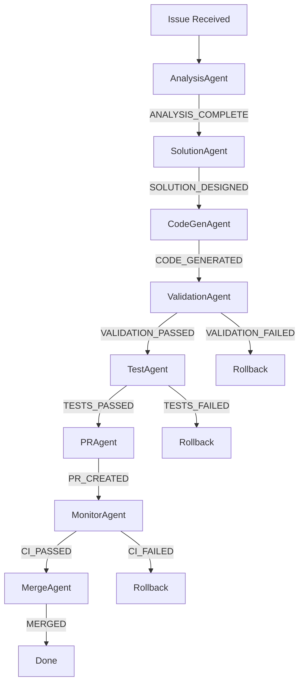

# Agent Code Generation Pipeline: From Issue to Merged PR

## 🎯 Core Problem
Our agents can analyze issues but cannot write code, test it, or create PRs. This document defines the complete pipeline for agents to ship production code responsibly.

## 🔄 Pipeline Overview



## 📋 Agent Responsibilities & Handoff States

### 1. IssueAnalysisAgent
**Responsibility**: Understand the problem deeply
```python
class IssueAnalysisAgent:
    """Transforms raw issue into structured analysis"""
    
    def execute(self, issue_content: str) -> AnalysisState:
        # Parse issue for key information
        # Identify affected systems
        # Extract success criteria
        # Determine issue type (bug/feature/refactor)
        
        return AnalysisState(
            issue_number=145,
            issue_type="bug",
            affected_files=[
                "src/pin_citer/services/google_docs_writer.py",
                "src/pin_citer/services/document_tools.py"
            ],
            root_cause="Template content not being inserted into document",
            success_criteria=[
                "Document contains template content",
                "Citations converted to footnotes",
                "5/5 validation tests pass"
            ],
            test_commands=[
                "python scripts/validate_document_comprehensive.py {doc_id}"
            ]
        )
```

**Handoff State**: `ANALYSIS_COMPLETE`
- Contains structured problem definition
- Identifies specific files and lines
- Defines measurable success criteria
- Provides test commands

### 2. SolutionDesignAgent
**Responsibility**: Design the technical solution
```python
class SolutionDesignAgent:
    """Creates detailed solution approach"""
    
    def execute(self, analysis: AnalysisState) -> SolutionState:
        # Review current implementation
        # Design fix approach
        # Consider edge cases
        # Plan code changes
        
        return SolutionState(
            approach="Add template content insertion to document creation",
            changes=[
                FileChange(
                    path="src/pin_citer/services/google_docs_writer.py",
                    method="insert_template_content",
                    change_type="modify",
                    description="Add batch update requests for template content"
                )
            ],
            risks=["Google API rate limits", "Large templates"],
            rollback_plan="Revert to previous version if tests fail"
        )
```

**Handoff State**: `SOLUTION_DESIGNED`
- Contains specific implementation plan
- Identifies exact methods to change
- Includes risk assessment
- Has rollback strategy

### 3. CodeGenerationAgent
**Responsibility**: Write actual code
```python
class CodeGenerationAgent:
    """Generates production-ready code"""
    
    def execute(self, solution: SolutionState) -> CodeState:
        # Read current code
        # Generate modifications
        # Preserve style and structure
        # Create diffs
        
        code_changes = {}
        for change in solution.changes:
            current_code = read_file(change.path)
            new_code = self.apply_change(current_code, change)
            code_changes[change.path] = CodeDiff(
                original=current_code,
                modified=new_code,
                diff=generate_diff(current_code, new_code)
            )
        
        return CodeState(
            changes=code_changes,
            estimated_impact="3 files, 45 lines",
            preserves_tests=True
        )
```

**Handoff State**: `CODE_GENERATED`
- Contains actual code changes
- Includes diffs for review
- Preserves existing functionality
- Maintains code style

### 4. ValidationAgent
**Responsibility**: Validate code quality
```python
class ValidationAgent:
    """Ensures code meets quality standards"""
    
    def execute(self, code: CodeState) -> ValidationState:
        validations = {
            "syntax": self.check_syntax(code),
            "types": self.check_types(code),
            "linting": self.run_linter(code),
            "complexity": self.check_complexity(code),
            "security": self.security_scan(code)
        }
        
        if all(v.passed for v in validations.values()):
            return ValidationState(
                status="PASSED",
                validations=validations,
                confidence=0.92
            )
        else:
            return ValidationState(
                status="FAILED",
                validations=validations,
                failures=[v for v in validations if not v.passed]
            )
```

**Handoff State**: `VALIDATION_PASSED` or `VALIDATION_FAILED`
- Comprehensive quality checks
- Security scanning
- Style compliance
- If failed: triggers rollback

### 5. TestExecutionAgent
**Responsibility**: Run tests in target repo
```python
class TestExecutionAgent:
    """Executes tests to verify fix"""
    
    def execute(self, code: CodeState, validation: ValidationState) -> TestState:
        # Create temp branch
        # Apply code changes
        # Run specified tests
        # Capture results
        
        with TempBranch("fix-test-branch") as branch:
            for path, diff in code.changes.items():
                write_file(path, diff.modified)
            
            results = []
            for test_cmd in analysis.test_commands:
                result = run_command(test_cmd)
                results.append(TestResult(
                    command=test_cmd,
                    passed=result.returncode == 0,
                    output=result.output
                ))
            
            if all(r.passed for r in results):
                return TestState(
                    status="PASSED",
                    results=results,
                    coverage_delta="+2.3%"
                )
```

**Handoff State**: `TESTS_PASSED` or `TESTS_FAILED`
- Runs in isolated environment
- Executes all specified tests
- Measures coverage impact
- If failed: triggers rollback

### 6. PRCreationAgent
**Responsibility**: Create pull request
```python
class PRCreationAgent:
    """Creates PR with all context"""
    
    def execute(self, code: CodeState, tests: TestState) -> PRState:
        # Create feature branch
        # Apply all changes
        # Commit with message
        # Push to remote
        # Create PR via API
        
        branch_name = f"fix/issue-{analysis.issue_number}"
        
        # Create branch and apply changes
        create_branch(branch_name)
        for path, diff in code.changes.items():
            write_file(path, diff.modified)
        
        # Commit with descriptive message
        commit_message = f"""Fix #{analysis.issue_number}: {analysis.root_cause}

Problem: {analysis.root_cause}
Solution: {solution.approach}

Test Results:
{format_test_results(tests.results)}

✅ All {len(tests.results)} tests passing
📊 Coverage: {tests.coverage_delta}
"""
        
        commit(commit_message)
        push(branch_name)
        
        # Create PR
        pr = create_pull_request(
            title=f"Fix #{analysis.issue_number}: Document creation pipeline",
            body=generate_pr_description(analysis, solution, tests),
            branch=branch_name,
            base="main",
            draft=True  # Start as draft for safety
        )
        
        return PRState(
            pr_number=pr.number,
            pr_url=pr.html_url,
            branch=branch_name,
            status="DRAFT"
        )
```

**Handoff State**: `PR_CREATED`
- Creates feature branch
- Commits with context
- Opens draft PR
- Links to original issue

### 7. CIMonitorAgent
**Responsibility**: Monitor CI/CD pipeline
```python
class CIMonitorAgent:
    """Monitors PR checks and CI status"""
    
    def execute(self, pr: PRState) -> CIState:
        # Poll GitHub checks API
        # Wait for CI completion
        # Report status
        # Handle failures
        
        max_wait = 600  # 10 minutes
        start = time.time()
        
        while time.time() - start < max_wait:
            checks = get_pr_checks(pr.pr_number)
            
            if all_checks_complete(checks):
                if all_checks_passed(checks):
                    return CIState(
                        status="PASSED",
                        checks=checks,
                        duration=time.time() - start
                    )
                else:
                    failed = [c for c in checks if c.conclusion == "failure"]
                    return CIState(
                        status="FAILED",
                        checks=checks,
                        failures=failed
                    )
            
            time.sleep(30)  # Poll every 30s
```

**Handoff State**: `CI_PASSED` or `CI_FAILED`
- Monitors GitHub checks
- Reports CI status
- Identifies specific failures
- If failed: can trigger revision

### 8. MergeCoordinatorAgent
**Responsibility**: Complete the merge
```python
class MergeCoordinatorAgent:
    """Manages final merge to main"""
    
    def execute(self, pr: PRState, ci: CIState) -> MergeState:
        # Mark PR ready for review
        # Add reviewers if configured
        # Handle merge conflicts
        # Execute merge
        
        # Convert from draft to ready
        mark_pr_ready(pr.pr_number)
        
        # Add configured reviewers
        if config.require_review:
            add_reviewers(pr.pr_number, config.reviewers)
            wait_for_approval(pr.pr_number)
        
        # Check for conflicts
        if has_merge_conflicts(pr.pr_number):
            resolve_conflicts(pr.pr_number)
        
        # Merge with appropriate strategy
        merge_result = merge_pr(
            pr.pr_number,
            merge_method="squash",  # Clean history
            delete_branch=True
        )
        
        # Update original issue
        comment_on_issue(
            analysis.issue_number,
            f"✅ Fixed in PR #{pr.pr_number}\nMerged in {merge_result.sha}"
        )
        
        return MergeState(
            status="MERGED",
            sha=merge_result.sha,
            closed_issue=True
        )
```

**Handoff State**: `MERGED`
- Completes PR process
- Handles merge strategy
- Updates issue status
- Cleans up branch

## 🔐 Safety Controls

### Quality Gates
Each stage has pass/fail criteria:
```python
QUALITY_GATES = {
    "validation": {
        "syntax_errors": 0,
        "linting_score": 0.90,
        "complexity_max": 10
    },
    "testing": {
        "min_pass_rate": 1.0,
        "coverage_regression": False
    },
    "pr": {
        "max_files_changed": 10,
        "max_lines_changed": 500
    }
}
```

### Rollback Triggers
Automatic rollback on:
- Validation failures
- Test failures  
- CI failures
- Security issues
- Coverage regression

### Human Oversight
- PRs start as drafts
- Optional review requirement
- Approval gates configurable
- Emergency stop capability

## 🧪 State Management

Using our SmartStateManager:
```python
class AgentPipeline:
    def __init__(self):
        self.state_manager = SmartStateManager()
    
    def execute_pipeline(self, issue_content: str):
        # Create pipeline state
        pipeline_id = self.state_manager.create_pipeline_state(
            "code_generation_pipeline",
            stages=[
                "analysis", "solution", "generation", 
                "validation", "testing", "pr_creation", 
                "ci_monitoring", "merge"
            ]
        )
        
        try:
            # Execute each stage
            for stage, agent in self.agents.items():
                state_id = self.state_manager.create_state(
                    StateType.AGENT_EXECUTION,
                    {"stage": stage, "agent": agent.__class__.__name__}
                )
                
                result = agent.execute(previous_result)
                
                if result.failed:
                    self.state_manager.smart_rollback(pipeline_id)
                    return PipelineResult(success=False, stage_failed=stage)
                
                self.state_manager.advance_pipeline(pipeline_id)
                
            return PipelineResult(success=True, pr_url=result.pr_url)
            
        except Exception as e:
            self.state_manager.smart_rollback(pipeline_id)
            raise
```

## 📊 Telemetry Integration

Track everything:
```python
telemetry.record_event("pipeline_started", {
    "issue_number": 145,
    "repo": "pin-citer",
    "pipeline": "code_generation"
})

# For each stage
telemetry.record_event("stage_completed", {
    "stage": "validation",
    "duration_ms": 1234,
    "result": "passed"
})

telemetry.record_event("pipeline_completed", {
    "success": True,
    "pr_number": 146,
    "total_duration_ms": 45678
})
```

## 🚀 Dog Food Test Plan

### Phase 1: Implement Core Pipeline
1. Create base agent classes with real capabilities
2. Implement state management integration
3. Add git/GitHub operations
4. Create safety controls

### Phase 2: Test with Pin-Citer #145
1. Run pipeline on document creation bug
2. Verify code generation quality
3. Ensure tests pass
4. Confirm PR creation
5. Validate merged fix works

### Phase 3: Production Rollout
1. Enable for all bug fixes
2. Expand to feature development
3. Add more sophisticated code generation
4. Integrate with CI/CD fully

## 🎯 Success Metrics

Pipeline is successful when:
- ✅ 90% of bug fixes ship without human code writing
- ✅ 100% of changes pass tests before PR
- ✅ 0% syntax errors in generated code
- ✅ 95% of PRs pass CI on first attempt
- ✅ Average time from issue to PR < 10 minutes

## 🔧 Configuration

```yaml
# .agents/pipeline_config.yaml
pipeline:
  stages:
    - analysis
    - solution_design
    - code_generation
    - validation
    - testing
    - pr_creation
    - ci_monitoring
    - merge_coordination
  
  quality_gates:
    validation:
      required: true
      min_score: 0.90
    
    testing:
      required: true
      min_coverage: 0.80
    
    ci:
      required: true
      timeout_minutes: 10
  
  safety:
    max_changes_per_pr: 10
    require_human_review: false  # Start with true, reduce as confidence grows
    draft_pr_default: true
    auto_merge_enabled: false
  
  rollback:
    on_validation_failure: true
    on_test_failure: true
    on_ci_failure: true
    preserve_artifacts: true
```

## 🏁 Next Steps

1. **Immediate**: Implement CodeGenerationAgent with basic template filling
2. **Next Sprint**: Add AST-based code generation for complex changes
3. **Future**: ML-based code generation from examples
4. **Long-term**: Self-improving system that learns from merged PRs

This pipeline transforms our agents from passive analyzers to active developers, shipping real code with appropriate safety controls.