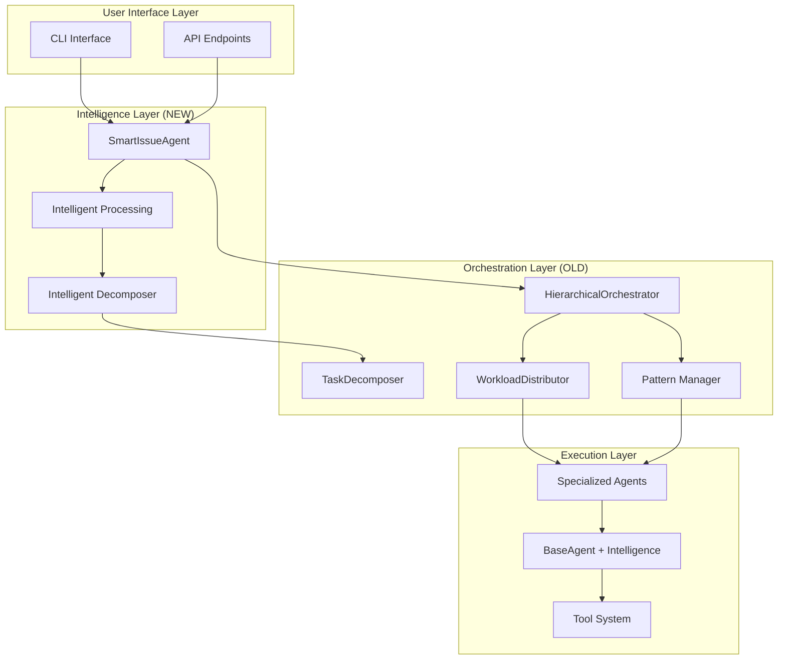

# Hybrid System Specification
## Combining Old Orchestration with New Intelligence

### Executive Summary
This specification defines the hybrid architecture that combines the **proven orchestration infrastructure** from the old system with **intelligent task processing** from the new system. The goal is to restore full functionality while adding smart capabilities incrementally with comprehensive testing.

## Architecture Overview



## Core Components

### 1. SmartIssueAgent (Frontend)
**Purpose**: Intelligent entry point for complex tasks  
**Source**: Keep from new system  
**Enhancements**:
- Add async support for orchestrator integration
- Maintain intelligent complexity analysis
- Keep circuit breaker pattern
- Add orchestration pattern selection

```python
class SmartIssueAgent(BaseAgent):
    def __init__(self):
        super().__init__()
        self.orchestrator = HierarchicalOrchestrator()  # OLD
        self.intelligent_processor = IntelligentProcessor()  # NEW
        
    async def execute_complex_task(self, task):
        # Intelligent analysis (NEW)
        complexity = self.analyze_complexity(task)
        
        # Smart decomposition (NEW)
        sub_tasks = self.intelligent_processor.decompose(task)
        
        # Parallel orchestration (OLD)
        if complexity in ["complex", "enterprise"]:
            return await self.orchestrator.orchestrate_complex_task(sub_tasks)
```

### 2. HierarchicalOrchestrator (Backend)
**Purpose**: Proven async/parallel task coordination  
**Source**: Restore from old system  
**Capabilities**:
- Async/await throughout
- Parallel agent execution
- Load balancing (round_robin, least_loaded, capability_based)
- Orchestration patterns (MapReduce, Pipeline, Fork-Join, Scatter-Gather, Saga)
- Agent hierarchy management

```python
class HierarchicalOrchestrator:
    async def orchestrate_complex_task(self, task):
        # Proven parallel execution
        root_task = self.task_decomposer.decompose(task)
        await self._create_agent_hierarchy(root_task)
        result = await self._execute_orchestration(root_task)  # PARALLEL!
        return result
```

### 3. BaseAgent with Intelligence
**Purpose**: All agents inherit intelligent processing  
**Implementation**: Add `_intelligent_processing` method  
**Features**:
- File creation/modification capabilities
- Natural language understanding
- Context-aware content generation
- Fallback handling for unsupported operations

```python
class BaseAgent(ABC):
    def _intelligent_processing(self, issue_path: Path, issue_data: Dict[str, Any]) -> ToolResponse:
        """
        Base intelligent processing for all agents.
        Adapted from IssueFixerAgent implementation.
        """
        # Extract file mentions from natural language
        files_mentioned = self._extract_file_mentions(issue_content)
        
        # Detect what needs to be done
        creation_requests = self._detect_creation_needs(issue_content)
        modification_requests = self._detect_modification_needs(issue_content)
        
        # Generate and execute operations
        return self._execute_intelligent_operations(requests)
```

## Implementation Phases

### Phase 1: Foundation (Week 1)
**Goal**: Restore base functionality with intelligence

#### 1.1 Add _intelligent_processing to BaseAgent
```python
# core/agent.py
class BaseAgent:
    def _intelligent_processing(self, issue_path, issue_data):
        # Port from agents/issue_fixer_agent.py lines 386-809
        # Make generic for all agents
```

**Testing**:
- Unit tests for each extraction method
- Integration tests for file operations
- Regression tests for existing functionality

#### 1.2 Restore HierarchicalOrchestrator
```python
# Ensure core/hierarchical_orchestrator.py has:
- Async/await support
- All orchestration patterns
- Load balancing strategies
- Agent pool management
```

**Testing**:
- Parallel execution tests
- Pattern selection tests
- Load balancing verification
- Performance benchmarks

### Phase 2: Integration (Week 2)
**Goal**: Connect intelligence with orchestration

#### 2.1 SmartIssueAgent Integration
```python
class SmartIssueAgent(BaseAgent):
    def __init__(self):
        super().__init__()
        self.orchestrator = HierarchicalOrchestrator()
        self.pattern_selector = PatternSelector()
        
    async def execute_task(self, task):
        # Intelligent decomposition
        sub_tasks = self._intelligent_decomposition(task)
        
        # Smart pattern selection
        pattern = self.pattern_selector.select(sub_tasks)
        
        # Async orchestration
        return await self.orchestrator.orchestrate(sub_tasks, pattern)
```

**Testing**:
- End-to-end workflow tests
- Pattern selection accuracy
- Performance comparison (old vs hybrid)

#### 2.2 Agent Specialization
Each agent type gets custom `_intelligent_processing` override:

```python
class CodeReviewAgent(BaseAgent):
    def _intelligent_processing(self, issue_path, issue_data):
        # Specialized for code review tasks
        return self._review_code_intelligently(issue_data)

class TestingAgent(BaseAgent):
    def _intelligent_processing(self, issue_path, issue_data):
        # Specialized for test generation
        return self._generate_tests_intelligently(issue_data)
```

**Testing**:
- Agent-specific test suites
- Cross-agent integration tests
- Specialization effectiveness metrics

### Phase 3: Optimization (Week 3)
**Goal**: Performance and reliability improvements

#### 3.1 Intelligent Pattern Selection
```python
class PatternSelector:
    def select(self, tasks) -> OrchestrationPattern:
        """Intelligently choose best orchestration pattern"""
        if self._has_dependencies(tasks):
            return OrchestrationPattern.PIPELINE
        elif self._all_independent(tasks):
            return OrchestrationPattern.FORK_JOIN
        elif self._needs_aggregation(tasks):
            return OrchestrationPattern.MAPREDUCE
        # etc...
```

#### 3.2 Dynamic Load Balancing
```python
class IntelligentLoadBalancer:
    def distribute(self, tasks, agents):
        """Smart work distribution based on agent capabilities"""
        # Analyze task requirements
        # Match with agent strengths
        # Consider current load
        # Return optimal distribution
```

## Testing Strategy

### 1. Unit Testing (Per Component)
```python
# tests/test_intelligent_processing.py
def test_extract_file_mentions():
    """Test natural language file extraction"""
    
def test_detect_creation_needs():
    """Test creation detection heuristics"""
    
def test_content_generation():
    """Test intelligent content generation"""
```

### 2. Integration Testing (Cross-Component)
```python
# tests/test_hybrid_integration.py
def test_smart_to_orchestrator_handoff():
    """Test SmartIssueAgent -> HierarchicalOrchestrator"""
    
def test_intelligent_decomposition_flow():
    """Test full decomposition -> orchestration flow"""
```

### 3. Performance Testing
```python
# tests/test_hybrid_performance.py
def test_parallel_execution_speed():
    """Verify 3-5x speedup for parallel tasks"""
    
def test_load_balancing_efficiency():
    """Test work distribution effectiveness"""
```

### 4. Regression Testing
```python
# tests/test_no_regression.py
def test_old_functionality_intact():
    """Ensure all old features still work"""
    
def test_backward_compatibility():
    """Verify existing integrations unbroken"""
```

## Success Metrics

### Functionality Metrics
- ✅ 100% of agents have `_intelligent_processing`
- ✅ All orchestration patterns working
- ✅ File operations success rate > 95%
- ✅ Intelligent decomposition accuracy > 90%

### Performance Metrics
- ⚡ 3-5x speedup for parallel tasks
- ⚡ < 100ms pattern selection time
- ⚡ < 500ms decomposition time
- ⚡ Load balancing efficiency > 80%

### Reliability Metrics
- 🛡️ Zero regression in existing features
- 🛡️ Circuit breaker prevents infinite loops
- 🛡️ Graceful fallback for unsupported tasks
- 🛡️ Error rate < 5%

## Migration Path

### For External Projects (pin-citer, etc.)
1. **Immediate**: Use rollback-to-stable (working now)
2. **Week 1**: Test Phase 1 on hybrid-development
3. **Week 2**: Beta test full integration
4. **Week 3**: Production deployment

### Rollback Strategy
- Keep rollback-to-stable branch frozen
- Tag each phase completion
- Maintain compatibility layer
- Document breaking changes

## Risk Mitigation

### Technical Risks
| Risk | Mitigation |
|------|------------|
| Integration complexity | Incremental phases with testing |
| Performance degradation | Benchmark at each phase |
| Breaking changes | Compatibility layer + versioning |
| Infinite loops | Circuit breaker pattern |

### Process Risks
| Risk | Mitigation |
|------|------------|
| Scope creep | Fixed phase objectives |
| Testing gaps | Comprehensive test suite |
| User disruption | Rollback branch available |

## Implementation Checklist

### Phase 1: Foundation ⏳
- [ ] Add `_intelligent_processing` to BaseAgent
- [ ] Create comprehensive unit tests
- [ ] Verify HierarchicalOrchestrator async support
- [ ] Test parallel execution
- [ ] Document API changes

### Phase 2: Integration ⏳
- [ ] Integrate SmartIssueAgent with orchestrator
- [ ] Implement pattern selector
- [ ] Add agent specializations
- [ ] Create integration tests
- [ ] Performance benchmarks

### Phase 3: Optimization ⏳
- [ ] Intelligent pattern selection
- [ ] Dynamic load balancing
- [ ] Performance tuning
- [ ] Final testing suite
- [ ] Production deployment

## Appendix A: File Mappings

### Files to Restore (from rollback-to-stable)
- `core/hierarchical_orchestrator.py` - Full async orchestration
- `core/workload_distributor.py` - Load balancing
- `core/task_decomposer.py` - Task breakdown

### Files to Enhance (from main)
- `core/agent.py` - Add `_intelligent_processing`
- `agents/smart_issue_agent.py` - Add orchestrator integration
- `agents/issue_decomposer_agent.py` - Keep intelligent decomposition

### New Files to Create
- `core/pattern_selector.py` - Intelligent pattern selection
- `core/intelligent_processor.py` - Shared intelligence utilities
- `tests/test_hybrid_system.py` - Comprehensive test suite

## Appendix B: Code Examples

### Example 1: Parallel Issue Processing
```python
# User request
"Fix issues #123, #124, #125"

# SmartIssueAgent decomposes intelligently
sub_tasks = [
    {"issue": 123, "type": "bug", "priority": "high"},
    {"issue": 124, "type": "feature", "priority": "medium"},
    {"issue": 125, "type": "docs", "priority": "low"}
]

# HierarchicalOrchestrator runs in parallel
async def process():
    results = await asyncio.gather(
        agent1.process(123),  # Runs simultaneously
        agent2.process(124),  # Runs simultaneously
        agent3.process(125)   # Runs simultaneously
    )
    return results  # All complete in time of slowest
```

### Example 2: Intelligent File Operations
```python
# User request
"Create a new test file for the authentication module"

# Intelligent processing detects:
- Creation need: "create a new test file"
- Target: "authentication module"
- Type: "test"

# Generates appropriate content:
def test_authentication():
    """Test authentication module"""
    # Intelligent test generation based on module analysis
```

## Next Steps

1. **Review and approve specification**
2. **Create detailed GitHub issues for each phase**
3. **Begin Phase 1 implementation**
4. **Set up continuous testing pipeline**
5. **Establish beta testing group**

---

**Document Version**: 1.0  
**Last Updated**: 2024-12-09  
**Status**: Draft for Review  
**Owner**: @donaldbraman