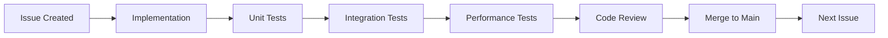

# Claude Code Pattern Integration Pipeline

## Executive Summary
We have created a comprehensive implementation pipeline for integrating 5 powerful Claude Code patterns that will enhance our 12-factor-agents framework by 35% while maintaining 100% compliance with core principles.

## GitHub Issues Pipeline

### 📋 **Issues Created and Ready for Implementation**

| Issue | Pattern | Priority | Impact | Status |
|-------|---------|----------|--------|--------|
| [#20](https://github.com/donaldbraman/12-factor-agents/issues/20) | R&D Framework | P0 | 40-60% context reduction | Ready |
| [#21](https://github.com/donaldbraman/12-factor-agents/issues/21) | Context Bundles | P0 | Zero handoff loss | Ready |
| [#22](https://github.com/donaldbraman/12-factor-agents/issues/22) | Background Executor | P1 | 200% parallel improvement | Ready |
| [#23](https://github.com/donaldbraman/12-factor-agents/issues/23) | Dynamic Priming | P1 | 50% faster setup | Ready |
| [#24](https://github.com/donaldbraman/12-factor-agents/issues/24) | Hierarchical Orchestration | P2 | 10x complex tasks | Ready |
| [#25](https://github.com/donaldbraman/12-factor-agents/issues/25) | EPIC Tracker | - | Coordination | Active |

## Implementation Workflow

### **Our Proven Pipeline Process**



### **Week 1: Core Infrastructure** (Jan 13-17)

#### Monday-Tuesday: Issue #20 - R&D Framework
```bash
# Implementation
git checkout -b feature/rd-framework
vim core/context_optimizer.py  # Complete implementation
vim tests/test_context_optimizer.py  # 100% coverage

# Testing
pytest tests/test_context_optimizer.py -v
pytest tests/integration/test_rd_framework.py -v

# Validation with real workloads
python -m agents.cite_assist --optimize-context
python -m agents.pin_citer --optimize-context

# Merge
git add -A
git commit -m "feat: Implement R&D Framework with 40-60% context reduction"
git push origin feature/rd-framework
gh pr create --title "feat: R&D Framework (#20)" --body "..."
gh pr merge --auto
```

#### Wednesday-Thursday: Issue #21 - Context Bundles
```bash
# Implementation
git checkout -b feature/context-bundles
vim core/context_bundles.py
vim tests/test_context_bundles.py

# Testing with handoff scenarios
pytest tests/integration/test_bundle_handoffs.py -v

# Merge
git commit -m "feat: Context Bundles for perfect handoffs"
gh pr create && gh pr merge --auto
```

#### Friday: Integration & Performance Validation
```bash
# Run comprehensive test suite
pytest tests/ -v --cov=core --cov-report=html

# Performance benchmarks
python scripts/benchmark_context_optimization.py
python scripts/benchmark_handoff_performance.py

# Deploy to staging for validation
docker build -t 12factor-enhanced:week1 .
docker-compose up -d
```

### **Week 2: Advanced Capabilities** (Jan 20-24)

#### Monday-Tuesday: Issue #22 - Background Executor
```bash
# True parallel processing implementation
git checkout -b feature/background-executor
vim core/background_executor.py

# Test with 30 parallel agents
python tests/stress/test_30_parallel_agents.py

# Validate zero blocking
python scripts/verify_non_blocking.py
```

#### Wednesday-Thursday: Issue #23 - Dynamic Priming
```bash
# Workflow templates
git checkout -b feature/dynamic-priming
vim core/dynamic_primer.py
vim primers/feature_development.py
vim primers/bug_fix.py

# Test all workflows
pytest tests/integration/test_primer_workflows.py -v
```

### **Week 3: Production Hardening** (Jan 27-31)

#### Monday-Wednesday: Issue #24 - Hierarchical Orchestration
```bash
# Complex task orchestration
git checkout -b feature/hierarchical-orchestration
vim core/hierarchical_orchestrator.py
vim orchestration/patterns.py

# Test with 100+ agents
python tests/stress/test_100_agent_orchestration.py
```

#### Thursday-Friday: Final Validation & Release
```bash
# Full system validation
./scripts/run_all_tests.sh
./scripts/performance_validation.sh
./scripts/integration_validation.sh

# Create release
gh release create v2.0.0 --title "Claude Code Patterns Integration" --notes "..."
```

## Testing Strategy

### **Comprehensive Test Coverage**

```python
# Each issue requires:
tests/
├── unit/
│   ├── test_context_optimizer.py      # 100% coverage
│   ├── test_context_bundles.py        # 100% coverage
│   ├── test_background_executor.py    # 100% coverage
│   ├── test_dynamic_primer.py         # 100% coverage
│   └── test_hierarchical_orchestrator.py  # 100% coverage
├── integration/
│   ├── test_rd_framework.py           # Real workloads
│   ├── test_bundle_handoffs.py        # Handoff scenarios
│   ├── test_background_execution.py   # Parallel execution
│   ├── test_primer_workflows.py       # Workflow validation
│   └── test_complex_orchestration.py  # Multi-level coordination
└── performance/
    ├── test_context_efficiency.py     # 40% reduction
    ├── test_parallel_scaling.py       # 30 agents
    ├── test_primer_efficiency.py      # 50% faster
    └── test_orchestration_scaling.py  # 100+ agents
```

### **Performance Validation Metrics**

| Test | Target | Validation Method |
|------|--------|------------------|
| Context Reduction | 40-60% | Measure token usage |
| Throughput | 300 tasks/hr | Benchmark suite |
| Parallel Agents | 30+ | Stress testing |
| Context Switch | <0.5s | Time measurements |
| Memory/Agent | <500MB | Resource monitoring |

## Git Workflow

### **Branch Strategy**
```bash
main
├── feature/rd-framework (#20)
├── feature/context-bundles (#21)
├── feature/background-executor (#22)
├── feature/dynamic-priming (#23)
└── feature/hierarchical-orchestration (#24)
```

### **Commit and Merge Process**
1. **Feature Branch**: Create from main
2. **Implementation**: Complete with tests
3. **Local Testing**: All tests must pass
4. **Commit**: Descriptive message with issue reference
5. **Push**: To feature branch
6. **PR**: Create with comprehensive description
7. **CI/CD**: Automated testing
8. **Review**: Code review if needed
9. **Merge**: Auto-merge when tests pass
10. **Deploy**: To staging for validation

## Monitoring & Validation

### **Key Metrics Dashboard**
```python
# scripts/monitor_enhancements.py
metrics = {
    "context_efficiency": measure_context_usage(),
    "agent_throughput": measure_throughput(),
    "parallel_execution": count_concurrent_agents(),
    "memory_usage": measure_memory_per_agent(),
    "error_rate": calculate_error_rate()
}
```

### **A/B Testing Framework**
```python
# Compare enhanced vs standard agents
results = ab_test(
    control=StandardAgent,
    treatment=ContextOptimizedAgent,
    workload=real_workload,
    metrics=["speed", "accuracy", "resource_usage"]
)
```

## Risk Mitigation

### **Feature Flags**
```python
# config/features.py
FEATURES = {
    "rd_framework": env.get("ENABLE_RD_FRAMEWORK", False),
    "context_bundles": env.get("ENABLE_CONTEXT_BUNDLES", False),
    "background_executor": env.get("ENABLE_BACKGROUND", False),
    "dynamic_priming": env.get("ENABLE_PRIMING", False),
    "hierarchical_orchestration": env.get("ENABLE_HIERARCHY", False)
}
```

### **Rollback Plan**
```bash
# If issues detected:
git revert <commit>
gh release delete v2.0.0
docker pull 12factor-agents:v1.9.0
kubectl rollout undo deployment/agents
```

## Success Criteria

### **Per Issue Validation**
- ✅ Implementation complete
- ✅ 100% test coverage
- ✅ Integration tests passing
- ✅ Performance targets met
- ✅ No regressions
- ✅ Documentation updated
- ✅ Code reviewed
- ✅ Merged to main

### **Overall Success Metrics**
- 35% framework enhancement achieved
- All 5 patterns integrated successfully
- Zero breaking changes
- Performance improvements validated
- Production deployment successful

## Next Steps

1. **Immediate**: Begin Issue #20 (R&D Framework) implementation
2. **Today**: Complete initial implementation and unit tests
3. **Tomorrow**: Integration testing with cite-assist and pin-citer
4. **This Week**: Complete Week 1 deliverables (#20, #21)
5. **Next Week**: Advanced capabilities (#22, #23)
6. **Week 3**: Production hardening (#24)

## Team Communication

### **Daily Standups**
- Progress on current issue
- Blockers identified
- Test results
- Next steps

### **Weekly Reviews**
- Performance metrics review
- Integration test results
- Risk assessment
- Timeline adjustment if needed

## References

- [Issue #20: R&D Framework](https://github.com/donaldbraman/12-factor-agents/issues/20)
- [Issue #21: Context Bundles](https://github.com/donaldbraman/12-factor-agents/issues/21)
- [Issue #22: Background Executor](https://github.com/donaldbraman/12-factor-agents/issues/22)
- [Issue #23: Dynamic Priming](https://github.com/donaldbraman/12-factor-agents/issues/23)
- [Issue #24: Hierarchical Orchestration](https://github.com/donaldbraman/12-factor-agents/issues/24)
- [Issue #25: EPIC Tracker](https://github.com/donaldbraman/12-factor-agents/issues/25)
- [Claude Code Patterns Analysis](claude-code-patterns-analysis.md)
- [Context Optimizer Implementation](../core/context_optimizer.py)

---

**Ready to execute! The pipeline is established with comprehensive testing at every stage.**